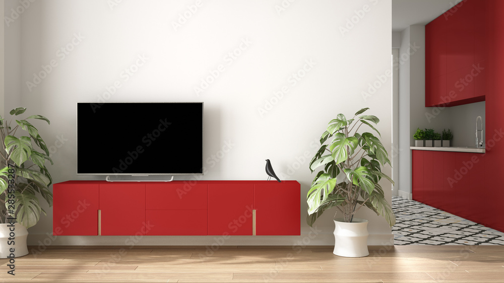
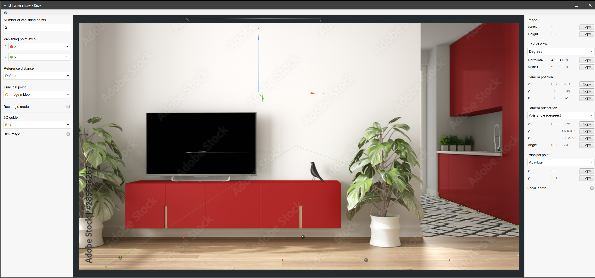
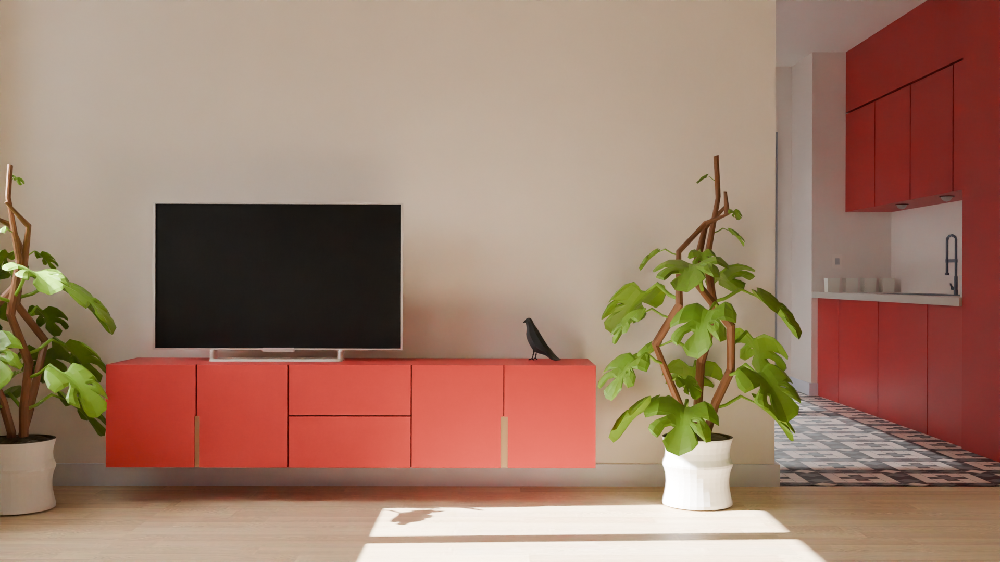
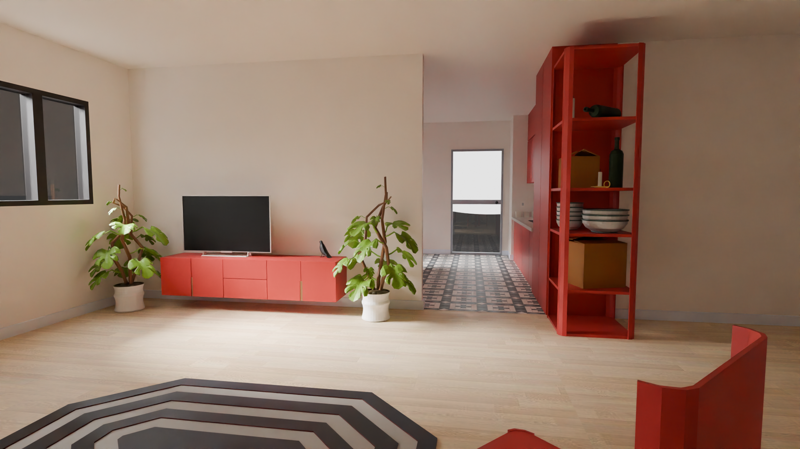
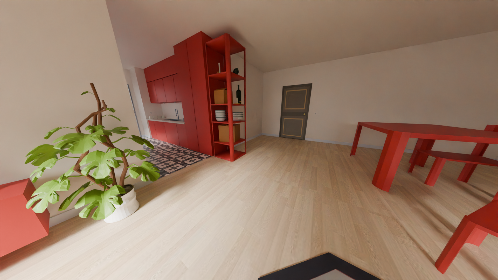
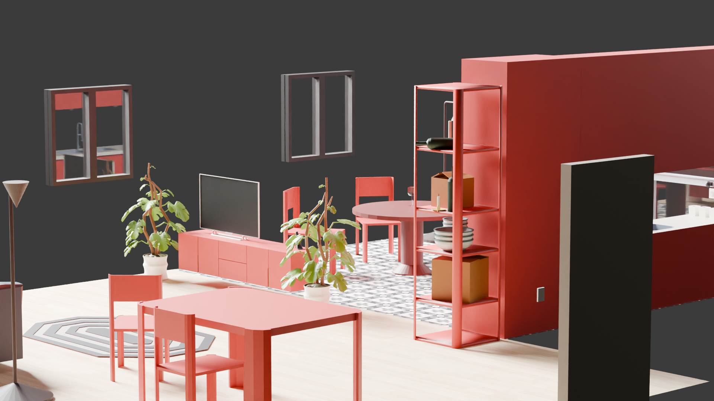
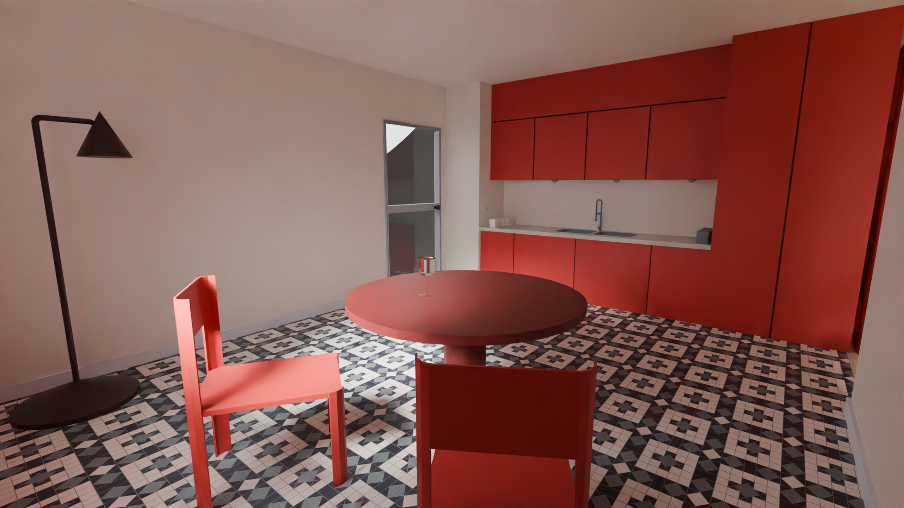

# lab_realta_virtuale_1
University project for Virtual Reality 1 exam, i had to recreate in Blender a virtual enviroment based of a real photo and make an interactable scene in Unity
<!-- BREAKPOINT -->
Modeling and scripting process documentation in "Realta Virtuale.pdf" file
<!-- BREAKPOINT -->
Unity gameplay demonstration video at: https://youtu.be/Gc5eIYpoJXI?feature=shared

---

## Starting photo
<!-- BREAKPOINT -->

   

<!-- BREAKPOINT -->

## Fspy
Using this tool i managed to set up some guide lines for a camera that if imported in Blender will mimic the perspective of the original photo. With this new point of view it is easier to model the scene maintaining the right proportions between the assets  
<!-- BREAKPOINT -->

   

<!-- BREAKPOINT -->

## Blender renders
<!-- BREAKPOINT -->

   

   
  

   
  

<!-- BREAKPOINT -->
